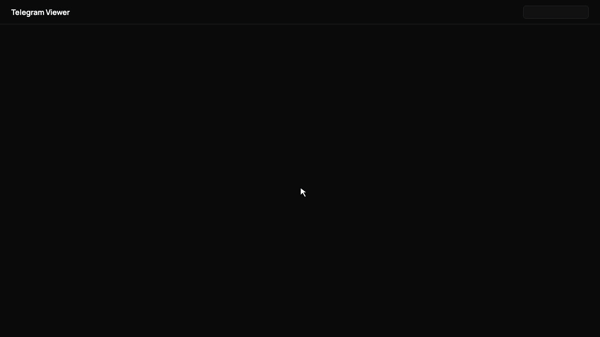
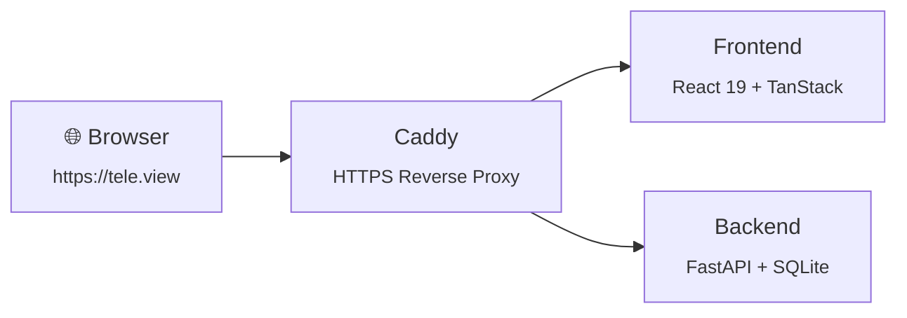

<div align="center">


# Telegram Viewer

A self-hosted web app for browsing and searching your Telegram media — photos, videos, and files — with face detection and filtering.

[](LICENSE)


</div>

<div align="center">



</div>

## Features

<table>
<tr>
<td width="50%">

**📸 Media Browser**

Browse photos, videos & files from your Telegram chats in a fast, searchable grid.

</td>
<td width="50%">

**👤 Face Detection**

Auto-detect faces and filter your photos by person using on-device AI.

</td>
</tr>
<tr>
<td width="50%">

**🔍 Search & Filter**

Search by chat, date range, and media type to find exactly what you need.

</td>
<td width="50%">

**🔒 Self-Hosted**

Your data stays on your machine. No cloud, no tracking, fully private.

</td>
</tr>
</table>

## Architecture



Data is stored in Docker volumes (`app-data` for the SQLite DB and cache, `insightface-models` for face detection models).

## Quick Start (Docker)

**Prerequisites:** [Docker Desktop](https://www.docker.com/products/docker-desktop/) installed and running.

### 1. Get Telegram API credentials

1. Go to [my.telegram.org/apps](https://my.telegram.org/apps)
2. Log in with your phone number
3. Click **API development tools**
4. Create an app (any name works, e.g. "viewer")
5. Note your **api_id** and **api_hash**

### 2. Run the setup script

```bash
git clone <repo-url> telegram-viewer
cd telegram-viewer
chmod +x setup.sh
./setup.sh
```

The script will:
- Prompt for your Telegram API credentials and create `.env`
- Add `tele.view` to `/etc/hosts` (requires sudo)
- Trust Caddy's local HTTPS certificate (requires sudo)
- Build and start all containers

### 3. Open the app

Go to **https://tele.view** and log in with your Telegram account.

---

## Manual Setup

If you prefer to set things up yourself:

```bash
# 1. Create .env from the example
cp .env.example .env
# Edit .env and fill in your TELEGRAM_API_ID and TELEGRAM_API_HASH

# 2. Add the local domain
echo '127.0.0.1 tele.view' | sudo tee -a /etc/hosts

# 3. Build and start
docker compose --profile prod up --build -d

# 4. Trust the HTTPS cert (after first start)
#    Extract Caddy's root CA from the container:
docker compose cp caddy:/data/caddy/pki/authorities/local/root.crt /tmp/caddy-ca.crt
#    macOS:
sudo security add-trusted-cert -d -r trustRoot -k /Library/Keychains/System.keychain /tmp/caddy-ca.crt
#    Linux (Debian/Ubuntu):
sudo cp /tmp/caddy-ca.crt /usr/local/share/ca-certificates/caddy-local.crt && sudo update-ca-certificates

# 5. Open https://tele.view
```

## Managing the App

```bash
docker compose --profile prod up -d        # Start
docker compose --profile prod down          # Stop
docker compose --profile prod logs -f       # View logs
docker compose --profile prod up --build -d # Rebuild after updates
```

## Development

Requires [just](https://github.com/casey/just), [uv](https://docs.astral.sh/uv/), and [bun](https://bun.sh/).

```bash
just install   # Install backend + frontend dependencies
just dev       # Start all dev servers with hot reload
just test      # Run backend tests
```

See `just --list` for all available commands.

## Troubleshooting

**"Your connection is not private" browser warning**
The Caddy CA cert isn't trusted. Re-run `./setup.sh` or follow the manual cert trust steps above.

**Cannot reach https://tele.view**
Check that `127.0.0.1 tele.view` is in your `/etc/hosts` file and that containers are running (`docker compose ps`).

**Containers fail to start**
Run `docker compose --profile prod logs` to see what went wrong. Most likely cause is missing or invalid Telegram API credentials in `.env`.
