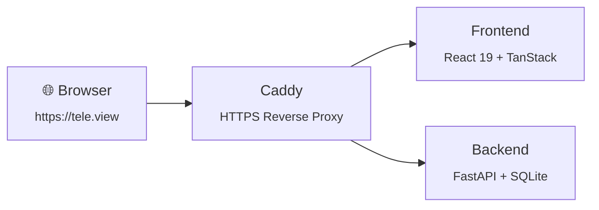

# Remotion Video + README Redesign — Implementation Plan

> **For agentic workers:** REQUIRED SUB-SKILL: Use superpowers:subagent-driven-development (recommended) or superpowers:executing-plans to implement this plan task-by-task. Steps use checkbox (`- [ ]`) syntax for tracking.

**Goal:** Add a Remotion project that produces an animated logo GIF and a synthetic UI demo video, then redesign the README to showcase them.

**Architecture:** A standalone `remotion/` folder at the repo root with its own `package.json`. Two compositions — `LogoAnimation` and `DemoVideo` — share design tokens via `shared/theme.ts`. Rendered assets go to `assets/` at the repo root. The README is rewritten to use the animated logo, embedded demo, feature cards, and a Mermaid architecture diagram.

**Tech Stack:** Remotion 4, React 19, TypeScript, `@remotion/google-fonts`, bun

**Spec:** `docs/superpowers/specs/2026-03-19-remotion-readme-design.md`

---

### Task 1: Scaffold the Remotion project

**Files:**
- Create: `remotion/package.json`
- Create: `remotion/tsconfig.json`
- Create: `remotion/src/index.ts`
- Create: `remotion/src/Root.tsx`
- Create: `assets/.gitkeep`

- [ ] **Step 1: Create `remotion/package.json`**

```json
{
  "name": "telegram-viewer-video",
  "private": true,
  "type": "module",
  "scripts": {
    "studio": "remotion studio",
    "render:logo": "remotion render LogoAnimation --codec=gif --output=../assets/logo-animated.gif",
    "render:logo-static": "remotion still LogoAnimation --frame=75 --output=../assets/logo-static.png",
    "render:demo": "remotion render DemoVideo --output=../assets/demo.mp4",
    "render:demo-gif": "remotion render DemoVideo --codec=gif --every-nth-frame=3 --output=../assets/demo.gif",
    "render:all": "bun run render:logo && bun run render:logo-static && bun run render:demo && bun run render:demo-gif"
  },
  "dependencies": {
    "@remotion/cli": "^4",
    "@remotion/google-fonts": "^4",
    "react": "^19.2.0",
    "react-dom": "^19.2.0",
    "remotion": "^4"
  },
  "devDependencies": {
    "@types/react": "^19",
    "typescript": "^5.7.2"
  }
}
```

- [ ] **Step 2: Create `remotion/tsconfig.json`**

```json
{
  "compilerOptions": {
    "target": "ES2022",
    "module": "ES2022",
    "moduleResolution": "bundler",
    "jsx": "react-jsx",
    "strict": true,
    "esModuleInterop": true,
    "skipLibCheck": true,
    "outDir": "dist"
  },
  "include": ["src"]
}
```

- [ ] **Step 3: Create `remotion/src/index.ts`**

Remotion entry point that registers the root component:

```ts
import { registerRoot } from 'remotion'
import { RemotionRoot } from './Root'

registerRoot(RemotionRoot)
```

- [ ] **Step 4: Create `remotion/src/Root.tsx`**

Register both compositions (placeholder components for now):

```tsx
import { Composition } from 'remotion'

const Placeholder = () => <div style={{ background: '#0a0a0a', width: '100%', height: '100%' }} />

export const RemotionRoot = () => {
  return (
    <>
      <Composition
        id="LogoAnimation"
        component={Placeholder}
        durationInFrames={90}
        fps={30}
        width={400}
        height={200}
      />
      <Composition
        id="DemoVideo"
        component={Placeholder}
        durationInFrames={450}
        fps={30}
        width={1280}
        height={720}
      />
    </>
  )
}
```

- [ ] **Step 5: Create `assets/` directory**

```bash
mkdir -p assets && touch assets/.gitkeep
```

- [ ] **Step 6: Install dependencies**

```bash
cd remotion && bun install
```

- [ ] **Step 7: Verify setup works by rendering a test frame**

```bash
bunx remotion still LogoAnimation --frame=0 --output=/tmp/test-frame.png
```

Expected: Produces a PNG file. This confirms the entry point, Root component, and compositions are wired correctly. Delete the test file after.

- [ ] **Step 8: Commit**

```bash
git add remotion/package.json remotion/tsconfig.json remotion/src/index.ts remotion/src/Root.tsx remotion/bun.lockb assets/.gitkeep
git commit -m "feat(remotion): scaffold project with two placeholder compositions"
```

---

### Task 2: Create shared theme and Logo SVG component

**Files:**
- Create: `remotion/src/shared/theme.ts`
- Create: `remotion/src/shared/Logo.tsx`

- [ ] **Step 1: Create `remotion/src/shared/theme.ts`**

Design tokens + Manrope font loading:

```ts
import { loadFont } from '@remotion/google-fonts/Manrope'

const { fontFamily } = loadFont()

export const theme = {
  fontFamily,
  colors: {
    background: '#0a0a0a',
    surface: '#111111',
    border: '#222222',
    text: '#ffffff',
    textMuted: '#888888',
    textSubtle: '#666666',
    accent: '#0284c7',
    accentGlow: 'rgba(2, 132, 199, 0.4)',
    bracketSearch: 'rgba(255, 255, 255, 0.3)',
  },
  radii: {
    card: 12,
    button: 8,
    avatar: 999,
  },
} as const
```

- [ ] **Step 2: Create `remotion/src/shared/Logo.tsx`**

SVG recreation of the viewfinder logo. The logo is a rounded square with a smaller rounded-rect bracket inside and a center dot:

```tsx
import type { CSSProperties } from 'react'

interface LogoProps {
  size?: number
  bracketColor?: string
  bracketOpacity?: number
  bracketScale?: number
  dotColor?: string
  dotOpacity?: number
  style?: CSSProperties
}

export const Logo: React.FC<LogoProps> = ({
  size = 80,
  bracketColor = '#ffffff',
  bracketOpacity = 1,
  bracketScale = 1,
  dotColor = '#ffffff',
  dotOpacity = 1,
  style,
}) => {
  const outerRadius = size * 0.2
  const innerSize = size * 0.625
  const innerRadius = innerSize * 0.2
  const innerOffset = (size - innerSize * bracketScale) / 2
  const dotSize = size * 0.05

  return (
    <svg
      width={size}
      height={size}
      viewBox={`0 0 ${size} ${size}`}
      style={style}
    >
      {/* Outer rounded square background */}
      <rect
        width={size}
        height={size}
        rx={outerRadius}
        fill="#000000"
      />
      {/* Inner viewfinder bracket */}
      <rect
        x={innerOffset}
        y={innerOffset}
        width={innerSize * bracketScale}
        height={innerSize * bracketScale}
        rx={innerRadius * bracketScale}
        fill="none"
        stroke={bracketColor}
        strokeWidth={size * 0.03}
        opacity={bracketOpacity}
      />
      {/* Center focus dot */}
      <circle
        cx={size / 2}
        cy={size / 2}
        r={dotSize}
        fill={dotColor}
        opacity={dotOpacity}
      />
    </svg>
  )
}
```

- [ ] **Step 3: Verify in studio**

Update `Root.tsx` to import and render the Logo in the `LogoAnimation` placeholder to confirm it looks correct:

```tsx
import { Composition } from 'remotion'
import { Logo } from './shared/Logo'
import { theme } from './shared/theme'

const LogoPreview = () => (
  <div style={{
    display: 'flex',
    alignItems: 'center',
    justifyContent: 'center',
    width: '100%',
    height: '100%',
    background: theme.colors.background,
    fontFamily: theme.fontFamily,
  }}>
    <Logo size={80} />
  </div>
)

const Placeholder = () => <div style={{ background: '#0a0a0a', width: '100%', height: '100%' }} />

export const RemotionRoot = () => {
  return (
    <>
      <Composition
        id="LogoAnimation"
        component={LogoPreview}
        durationInFrames={90}
        fps={30}
        width={400}
        height={200}
      />
      <Composition
        id="DemoVideo"
        component={Placeholder}
        durationInFrames={450}
        fps={30}
        width={1280}
        height={720}
      />
    </>
  )
}
```

Run: `cd remotion && bunx remotion still LogoAnimation --frame=45 --output=/tmp/logo-test.png`
Expected: Produces a PNG showing the viewfinder logo at mid-animation. Verify the file exists and is non-empty.

- [ ] **Step 4: Commit**

```bash
git add remotion/src/shared/theme.ts remotion/src/shared/Logo.tsx remotion/src/Root.tsx
git commit -m "feat(remotion): add shared theme with Manrope font and Logo SVG component"
```

---

### Task 3: Implement the LogoAnimation composition

**Files:**
- Create: `remotion/src/LogoAnimation.tsx`
- Modify: `remotion/src/Root.tsx`

- [ ] **Step 1: Create `remotion/src/LogoAnimation.tsx`**

The autofocus snap animation — 3 seconds (90 frames at 30fps):

```tsx
import {
  AbsoluteFill,
  interpolate,
  spring,
  useCurrentFrame,
  useVideoConfig,
} from 'remotion'
import { Logo } from './shared/Logo'
import { theme } from './shared/theme'

export const LogoAnimation: React.FC = () => {
  const frame = useCurrentFrame()
  const { fps } = useVideoConfig()

  // Phase 1: Fade in (0-15 frames / 0-0.5s)
  const fadeIn = interpolate(frame, [0, 15], [0, 1], {
    extrapolateRight: 'clamp',
  })

  // Phase 2: Searching pulse (frames 15-45 / 0.5-1.5s)
  const pulsePhase = interpolate(frame, [15, 45], [0, Math.PI * 3], {
    extrapolateLeft: 'clamp',
    extrapolateRight: 'clamp',
  })
  const pulseScale = frame >= 15 && frame < 45
    ? 1 + 0.05 * Math.sin(pulsePhase)
    : 1

  // Phase 3: Snap (frame 45 / 1.5s) — spring contraction
  const snapSpring = spring({
    frame: frame - 45,
    fps,
    config: { damping: 20, stiffness: 200, mass: 1 },
  })
  const snapScale = frame >= 45
    ? interpolate(snapSpring, [0, 1], [1, 0.85])
    : pulseScale

  // Color transition: white@30% → sky blue → white
  const isSearching = frame < 45
  const isSnapping = frame >= 45 && frame < 60
  const bracketColor = isSearching
    ? theme.colors.bracketSearch
    : isSnapping
      ? theme.colors.accent
      : '#ffffff'
  const bracketOpacity = isSearching ? fadeIn * 0.3 : 1

  // Dot appears at snap
  const dotOpacity = interpolate(frame, [45, 50], [0, 1], {
    extrapolateLeft: 'clamp',
    extrapolateRight: 'clamp',
  })

  // Glow during snap
  const glowOpacity = isSnapping
    ? interpolate(frame, [45, 55, 60], [0, 0.6, 0], {
        extrapolateLeft: 'clamp',
        extrapolateRight: 'clamp',
      })
    : 0

  // Text fade in (frames 60-72 / 2.0-2.4s)
  const textOpacity = interpolate(frame, [60, 72], [0, 1], {
    extrapolateLeft: 'clamp',
    extrapolateRight: 'clamp',
  })
  const textY = interpolate(frame, [60, 72], [8, 0], {
    extrapolateLeft: 'clamp',
    extrapolateRight: 'clamp',
  })

  return (
    <AbsoluteFill
      style={{
        background: theme.colors.background,
        display: 'flex',
        flexDirection: 'column',
        alignItems: 'center',
        justifyContent: 'center',
        gap: 12,
        fontFamily: theme.fontFamily,
      }}
    >
      <div style={{ position: 'relative' }}>
        {/* Glow effect behind logo during snap */}
        {glowOpacity > 0 && (
          <div
            style={{
              position: 'absolute',
              inset: -20,
              borderRadius: 30,
              background: theme.colors.accent,
              opacity: glowOpacity,
              filter: 'blur(20px)',
            }}
          />
        )}
        <div style={{ transform: `scale(${snapScale})` }}>
          <Logo
            size={80}
            bracketColor={bracketColor}
            bracketOpacity={bracketOpacity}
            dotColor={isSnapping ? theme.colors.accent : '#ffffff'}
            dotOpacity={dotOpacity}
          />
        </div>
      </div>
      <div
        style={{
          color: theme.colors.text,
          fontSize: 20,
          fontWeight: 600,
          opacity: textOpacity,
          transform: `translateY(${textY}px)`,
          letterSpacing: -0.3,
        }}
      >
        Telegram Viewer
      </div>
    </AbsoluteFill>
  )
}
```

- [ ] **Step 2: Update `Root.tsx` to use `LogoAnimation`**

Replace the `LogoPreview` placeholder:

```tsx
import { Composition } from 'remotion'
import { LogoAnimation } from './LogoAnimation'

const Placeholder = () => <div style={{ background: '#0a0a0a', width: '100%', height: '100%' }} />

export const RemotionRoot = () => {
  return (
    <>
      <Composition
        id="LogoAnimation"
        component={LogoAnimation}
        durationInFrames={90}
        fps={30}
        width={400}
        height={200}
      />
      <Composition
        id="DemoVideo"
        component={Placeholder}
        durationInFrames={450}
        fps={30}
        width={1280}
        height={720}
      />
    </>
  )
}
```

- [ ] **Step 3: Preview and tune in studio**

Run: `cd remotion && bunx remotion still LogoAnimation --frame=50 --output=/tmp/logo-snap-test.png`
Expected: Produces a PNG of the snap moment. Verify the logo is visible and non-empty.

- [ ] **Step 4: Render the logo GIF and static PNG**

```bash
mkdir -p ../assets
bunx remotion render LogoAnimation --codec=gif --output=../assets/logo-animated.gif
bunx remotion still LogoAnimation --frame=75 --output=../assets/logo-static.png
```

Expected: `assets/logo-animated.gif` (~3s looping GIF) and `assets/logo-static.png` (the settled logo frame).

- [ ] **Step 5: Commit**

```bash
git add remotion/src/LogoAnimation.tsx remotion/src/Root.tsx assets/logo-animated.gif assets/logo-static.png
git commit -m "feat(remotion): implement LogoAnimation with autofocus snap effect"
```

---

### Task 4: Create the FakeCursor component

**Files:**
- Create: `remotion/src/shared/FakeCursor.tsx`

- [ ] **Step 1: Create `remotion/src/shared/FakeCursor.tsx`**

An animated macOS-style pointer with click pulse:

```tsx
import {
  interpolate,
  useCurrentFrame,
} from 'remotion'

interface CursorKeyframe {
  frame: number
  x: number
  y: number
  click?: boolean
}

interface FakeCursorProps {
  keyframes: CursorKeyframe[]
}

export const FakeCursor: React.FC<FakeCursorProps> = ({ keyframes }) => {
  const frame = useCurrentFrame()

  if (keyframes.length === 0) return null

  // Find the two keyframes we're between
  let prev = keyframes[0]
  let next = keyframes[0]
  for (let i = 0; i < keyframes.length - 1; i++) {
    if (frame >= keyframes[i].frame && frame <= keyframes[i + 1].frame) {
      prev = keyframes[i]
      next = keyframes[i + 1]
      break
    }
    if (frame > keyframes[i + 1].frame) {
      prev = keyframes[i + 1]
      next = keyframes[i + 1]
    }
  }

  // Eased interpolation between keyframes
  const progress = prev === next
    ? 1
    : interpolate(
        frame,
        [prev.frame, next.frame],
        [0, 1],
        { extrapolateLeft: 'clamp', extrapolateRight: 'clamp' },
      )

  // Ease-in-out cubic
  const eased = progress < 0.5
    ? 4 * progress * progress * progress
    : 1 - Math.pow(-2 * progress + 2, 3) / 2

  const x = prev.x + (next.x - prev.x) * eased
  const y = prev.y + (next.y - prev.y) * eased

  // Click pulse — find if there's a click within 10 frames
  const activeClick = keyframes.find(
    (kf) => kf.click && Math.abs(frame - kf.frame) < 10,
  )
  const clickOpacity = activeClick
    ? interpolate(
        frame,
        [activeClick.frame, activeClick.frame + 10],
        [0.5, 0],
        { extrapolateLeft: 'clamp', extrapolateRight: 'clamp' },
      )
    : 0
  const clickScale = activeClick
    ? interpolate(
        frame,
        [activeClick.frame, activeClick.frame + 10],
        [0, 1],
        { extrapolateLeft: 'clamp', extrapolateRight: 'clamp' },
      )
    : 0

  return (
    <div
      style={{
        position: 'absolute',
        left: x,
        top: y,
        pointerEvents: 'none',
        zIndex: 9999,
      }}
    >
      {/* Click pulse ring */}
      {clickOpacity > 0 && (
        <div
          style={{
            position: 'absolute',
            width: 30,
            height: 30,
            borderRadius: '50%',
            border: '2px solid rgba(255, 255, 255, 0.6)',
            transform: `translate(-50%, -50%) scale(${clickScale})`,
            opacity: clickOpacity,
          }}
        />
      )}
      {/* macOS cursor SVG */}
      <svg
        width="18"
        height="22"
        viewBox="0 0 18 22"
        fill="none"
        style={{ filter: 'drop-shadow(0 1px 2px rgba(0,0,0,0.5))' }}
      >
        <path
          d="M1 1L1 17.5L5.5 13L10 21L13 19.5L8.5 11.5L14.5 11.5L1 1Z"
          fill="white"
          stroke="black"
          strokeWidth="1.2"
        />
      </svg>
    </div>
  )
}
```

- [ ] **Step 2: Verify it compiles**

Run: `cd remotion && bunx tsc --noEmit`
Expected: No TypeScript errors. The FakeCursor will be visually verified when composed into DemoVideo in Task 10.

- [ ] **Step 3: Commit**

```bash
git add remotion/src/shared/FakeCursor.tsx
git commit -m "feat(remotion): add FakeCursor component with eased movement and click pulse"
```

---

### Task 5: Implement DemoVideo Scene 1 — Media Grid

**Files:**
- Create: `remotion/src/DemoVideo/MediaGrid.tsx`

- [ ] **Step 1: Create `remotion/src/DemoVideo/MediaGrid.tsx`**

A 4-column grid of gradient placeholder tiles that stagger-animate in, with a scroll effect:

```tsx
import {
  AbsoluteFill,
  interpolate,
  spring,
  useCurrentFrame,
  useVideoConfig,
} from 'remotion'
import { theme } from '../shared/theme'

const COLS = 4
const ROWS = 4
const GAP = 6
const TILE_SIZE = 150

const gradients = [
  ['#1a1a2e', '#16213e'],
  ['#0f3460', '#1a1a2e'],
  ['#16213e', '#1a1a2e'],
  ['#1a1a2e', '#0f3460'],
  ['#1a1a2e', '#16213e'],
  ['#16213e', '#0f3460'],
  ['#0f3460', '#16213e'],
  ['#1a1a2e', '#16213e'],
  ['#16213e', '#1a1a2e'],
  ['#1a1a2e', '#0f3460'],
  ['#0f3460', '#1a1a2e'],
  ['#16213e', '#0f3460'],
  ['#1a1a2e', '#16213e'],
  ['#0f3460', '#16213e'],
  ['#16213e', '#1a1a2e'],
  ['#1a1a2e', '#0f3460'],
]

export const MediaGrid: React.FC = () => {
  const frame = useCurrentFrame()
  const { fps } = useVideoConfig()

  // Scroll offset — grid shifts up slowly
  const scrollY = interpolate(frame, [30, 90], [0, -80], {
    extrapolateLeft: 'clamp',
    extrapolateRight: 'clamp',
  })

  const gridWidth = COLS * TILE_SIZE + (COLS - 1) * GAP
  const gridLeft = (1280 - gridWidth) / 2

  return (
    <AbsoluteFill
      style={{
        background: theme.colors.background,
        fontFamily: theme.fontFamily,
      }}
    >
      {/* Top bar mock */}
      <div
        style={{
          height: 52,
          borderBottom: `1px solid ${theme.colors.border}`,
          display: 'flex',
          alignItems: 'center',
          padding: '0 24px',
          gap: 12,
        }}
      >
        <div style={{ color: theme.colors.text, fontWeight: 600, fontSize: 16 }}>
          Telegram Viewer
        </div>
        <div style={{ flex: 1 }} />
        <div
          style={{
            width: 140,
            height: 28,
            borderRadius: 6,
            background: theme.colors.surface,
            border: `1px solid ${theme.colors.border}`,
          }}
        />
      </div>

      {/* Grid area */}
      <div
        style={{
          position: 'relative',
          overflow: 'hidden',
          flex: 1,
          display: 'flex',
          justifyContent: 'center',
          paddingTop: 20,
        }}
      >
        <div
          style={{
            display: 'grid',
            gridTemplateColumns: `repeat(${COLS}, ${TILE_SIZE}px)`,
            gap: GAP,
            transform: `translateY(${scrollY}px)`,
          }}
        >
          {gradients.map((gradient, i) => {
            const staggerDelay = i * 2
            const tileSpring = spring({
              frame: frame - staggerDelay,
              fps,
              config: { damping: 15, stiffness: 120, mass: 0.8 },
            })
            const scale = interpolate(tileSpring, [0, 1], [0.8, 1])
            const opacity = interpolate(tileSpring, [0, 1], [0, 1])

            return (
              <div
                key={i}
                style={{
                  width: TILE_SIZE,
                  height: TILE_SIZE,
                  borderRadius: 4,
                  background: `linear-gradient(135deg, ${gradient[0]}, ${gradient[1]})`,
                  transform: `scale(${scale})`,
                  opacity,
                }}
              />
            )
          })}
        </div>
      </div>
    </AbsoluteFill>
  )
}
```

- [ ] **Step 2: Commit**

```bash
git add remotion/src/DemoVideo/MediaGrid.tsx
git commit -m "feat(remotion): add MediaGrid scene with stagger animation and scroll"
```

---

### Task 6: Implement DemoVideo Scene 2 — Photo Lightbox

**Files:**
- Create: `remotion/src/DemoVideo/PhotoLightbox.tsx`

- [ ] **Step 1: Create `remotion/src/DemoVideo/PhotoLightbox.tsx`**

A thumbnail expands into a lightbox view and then closes:

```tsx
import {
  AbsoluteFill,
  interpolate,
  spring,
  useCurrentFrame,
  useVideoConfig,
} from 'remotion'
import { theme } from '../shared/theme'

export const PhotoLightbox: React.FC = () => {
  const frame = useCurrentFrame()
  const { fps } = useVideoConfig()

  // Open animation (frames 0-20)
  const openSpring = spring({
    frame,
    fps,
    config: { damping: 15, stiffness: 150, mass: 1 },
  })

  // Close animation (starts at frame 60)
  const closeSpring = spring({
    frame: frame - 60,
    fps,
    config: { damping: 20, stiffness: 200, mass: 1 },
  })

  const isClosing = frame >= 60

  // Lightbox scale: thumbnail → full → thumbnail
  const scale = isClosing
    ? interpolate(closeSpring, [0, 1], [1, 0.15])
    : interpolate(openSpring, [0, 1], [0.15, 1])

  // Backdrop opacity
  const backdropOpacity = isClosing
    ? interpolate(closeSpring, [0, 1], [0.8, 0])
    : interpolate(openSpring, [0, 1], [0, 0.8])

  // Image position — starts at grid position, moves to center
  const imageX = isClosing
    ? interpolate(closeSpring, [0, 1], [0, -200])
    : interpolate(openSpring, [0, 1], [-200, 0])
  const imageY = isClosing
    ? interpolate(closeSpring, [0, 1], [0, -150])
    : interpolate(openSpring, [0, 1], [-150, 0])

  return (
    <AbsoluteFill style={{ background: theme.colors.background }}>
      {/* Dimmed grid background */}
      <AbsoluteFill style={{ opacity: 1 - backdropOpacity * 0.5 }}>
        <div
          style={{
            display: 'grid',
            gridTemplateColumns: 'repeat(4, 150px)',
            gap: 6,
            position: 'absolute',
            top: 72,
            left: '50%',
            transform: 'translateX(-50%)',
          }}
        >
          {Array.from({ length: 12 }).map((_, i) => (
            <div
              key={i}
              style={{
                width: 150,
                height: 150,
                borderRadius: 4,
                background: `linear-gradient(135deg, #1a1a2e, ${i % 2 === 0 ? '#16213e' : '#0f3460'})`,
                opacity: 0.4,
              }}
            />
          ))}
        </div>
      </AbsoluteFill>

      {/* Dark overlay */}
      <AbsoluteFill
        style={{
          background: `rgba(0, 0, 0, ${backdropOpacity})`,
        }}
      />

      {/* Lightbox photo */}
      <AbsoluteFill
        style={{
          display: 'flex',
          alignItems: 'center',
          justifyContent: 'center',
        }}
      >
        <div
          style={{
            width: 500,
            height: 350,
            borderRadius: 8,
            background: 'linear-gradient(135deg, #1a1a2e, #0f3460)',
            transform: `scale(${scale}) translate(${imageX}px, ${imageY}px)`,
            boxShadow: '0 25px 50px rgba(0, 0, 0, 0.5)',
          }}
        />
      </AbsoluteFill>
    </AbsoluteFill>
  )
}
```

- [ ] **Step 2: Commit**

```bash
git add remotion/src/DemoVideo/PhotoLightbox.tsx
git commit -m "feat(remotion): add PhotoLightbox scene with open/close spring animation"
```

---

### Task 7: Implement DemoVideo Scene 3 — Face Detection

**Files:**
- Create: `remotion/src/DemoVideo/FaceDetection.tsx`

- [ ] **Step 1: Create `remotion/src/DemoVideo/FaceDetection.tsx`**

Shows face bounding boxes appearing on a photo, then person avatar chips, then a filter:

```tsx
import {
  AbsoluteFill,
  interpolate,
  spring,
  useCurrentFrame,
  useVideoConfig,
} from 'remotion'
import { theme } from '../shared/theme'

const faces = [
  { x: 180, y: 120, w: 80, h: 96 },
  { x: 340, y: 100, w: 70, h: 84 },
  { x: 520, y: 140, w: 75, h: 90 },
]

const avatarColors = ['#1e3a5f', '#2d1b4e', '#1a3c34']

export const FaceDetection: React.FC = () => {
  const frame = useCurrentFrame()
  const { fps } = useVideoConfig()

  // Phase 1: Bounding boxes appear (frames 0-30)
  // Phase 2: Person chips slide in (frames 30-50)
  // Phase 3: One chip is "clicked", grid filters (frames 60-90)

  return (
    <AbsoluteFill
      style={{
        background: theme.colors.background,
        fontFamily: theme.fontFamily,
      }}
    >
      {/* "People" header */}
      <div
        style={{
          height: 52,
          borderBottom: `1px solid ${theme.colors.border}`,
          display: 'flex',
          alignItems: 'center',
          padding: '0 24px',
        }}
      >
        <div style={{ color: theme.colors.text, fontWeight: 600, fontSize: 16 }}>
          People
        </div>
      </div>

      {/* Main photo with face boxes */}
      <div
        style={{
          display: 'flex',
          gap: 24,
          padding: 24,
          flex: 1,
        }}
      >
        {/* Large photo */}
        <div
          style={{
            position: 'relative',
            width: 700,
            height: 450,
            borderRadius: 8,
            background: 'linear-gradient(135deg, #1a1a2e, #16213e)',
            overflow: 'hidden',
          }}
        >
          {/* Face bounding boxes */}
          {faces.map((face, i) => {
            const boxSpring = spring({
              frame: frame - i * 8,
              fps,
              config: { damping: 12, stiffness: 200, mass: 0.8 },
            })
            const scale = interpolate(boxSpring, [0, 1], [1.3, 1])
            const opacity = interpolate(boxSpring, [0, 1], [0, 1])

            return (
              <div
                key={i}
                style={{
                  position: 'absolute',
                  left: face.x,
                  top: face.y,
                  width: face.w,
                  height: face.h,
                  border: `2px solid ${theme.colors.accent}`,
                  borderRadius: 6,
                  boxShadow: `0 0 12px ${theme.colors.accentGlow}`,
                  transform: `scale(${scale})`,
                  opacity,
                }}
              />
            )
          })}
        </div>

        {/* Person chips sidebar */}
        <div style={{ display: 'flex', flexDirection: 'column', gap: 12, paddingTop: 8 }}>
          {avatarColors.map((color, i) => {
            const chipSpring = spring({
              frame: frame - 30 - i * 5,
              fps,
              config: { damping: 15, stiffness: 150, mass: 1 },
            })
            const translateX = interpolate(chipSpring, [0, 1], [40, 0])
            const opacity = interpolate(chipSpring, [0, 1], [0, 1])

            // Highlight the first chip when "clicked" at frame 60
            const isSelected = i === 0 && frame >= 60
            const selectOpacity = isSelected
              ? interpolate(frame, [60, 65], [0, 1], {
                  extrapolateLeft: 'clamp',
                  extrapolateRight: 'clamp',
                })
              : 0

            return (
              <div
                key={i}
                style={{
                  display: 'flex',
                  alignItems: 'center',
                  gap: 10,
                  transform: `translateX(${translateX}px)`,
                  opacity,
                  padding: '8px 12px',
                  borderRadius: 8,
                  background: selectOpacity > 0
                    ? `rgba(2, 132, 199, ${selectOpacity * 0.15})`
                    : 'transparent',
                  border: selectOpacity > 0
                    ? `1px solid rgba(2, 132, 199, ${selectOpacity * 0.3})`
                    : '1px solid transparent',
                }}
              >
                <div
                  style={{
                    width: 40,
                    height: 40,
                    borderRadius: '50%',
                    background: `linear-gradient(135deg, ${color}, ${color}dd)`,
                    border: `2px solid ${theme.colors.border}`,
                  }}
                />
                <div>
                  <div style={{ color: theme.colors.text, fontSize: 13, fontWeight: 500 }}>
                    Person {i + 1}
                  </div>
                  <div style={{ color: theme.colors.textSubtle, fontSize: 11 }}>
                    {12 - i * 3} photos
                  </div>
                </div>
              </div>
            )
          })}
        </div>
      </div>
    </AbsoluteFill>
  )
}
```

- [ ] **Step 2: Commit**

```bash
git add remotion/src/DemoVideo/FaceDetection.tsx
git commit -m "feat(remotion): add FaceDetection scene with bounding boxes and person chips"
```

---

### Task 8: Implement DemoVideo Scene 4 — Search & Filter

**Files:**
- Create: `remotion/src/DemoVideo/SearchFilter.tsx`

- [ ] **Step 1: Create `remotion/src/DemoVideo/SearchFilter.tsx`**

Typing animation in a search bar with filter chips appearing:

```tsx
import {
  AbsoluteFill,
  interpolate,
  spring,
  useCurrentFrame,
  useVideoConfig,
} from 'remotion'
import { theme } from '../shared/theme'

const SEARCH_TEXT = 'vacation 2024'

export const SearchFilter: React.FC = () => {
  const frame = useCurrentFrame()
  const { fps } = useVideoConfig()

  // Typing animation — one character every 3 frames, starting at frame 10
  const typedChars = Math.min(
    Math.floor(Math.max(0, frame - 10) / 3),
    SEARCH_TEXT.length,
  )
  const displayText = SEARCH_TEXT.slice(0, typedChars)
  const showCursor = frame % 20 < 14 // Blinking cursor

  // Filter chips appear after typing completes (around frame 55)
  const chipsFrame = 10 + SEARCH_TEXT.length * 3 + 10
  const chip1Spring = spring({
    frame: frame - chipsFrame,
    fps,
    config: { damping: 15, stiffness: 180, mass: 0.8 },
  })
  const chip2Spring = spring({
    frame: frame - chipsFrame - 5,
    fps,
    config: { damping: 15, stiffness: 180, mass: 0.8 },
  })

  // Grid results slide in after chips
  const gridFrame = chipsFrame + 15
  const gridOpacity = interpolate(frame, [gridFrame, gridFrame + 15], [0, 1], {
    extrapolateLeft: 'clamp',
    extrapolateRight: 'clamp',
  })
  const gridY = interpolate(frame, [gridFrame, gridFrame + 15], [20, 0], {
    extrapolateLeft: 'clamp',
    extrapolateRight: 'clamp',
  })

  return (
    <AbsoluteFill
      style={{
        background: theme.colors.background,
        fontFamily: theme.fontFamily,
        padding: 24,
      }}
    >
      {/* Top bar with search */}
      <div
        style={{
          height: 52,
          borderBottom: `1px solid ${theme.colors.border}`,
          display: 'flex',
          alignItems: 'center',
          gap: 16,
          marginBottom: 16,
          paddingBottom: 12,
        }}
      >
        <div style={{ color: theme.colors.text, fontWeight: 600, fontSize: 16 }}>
          Telegram Viewer
        </div>
        <div style={{ flex: 1 }} />
        {/* Search input */}
        <div
          style={{
            background: theme.colors.surface,
            border: `1px solid ${theme.colors.accent}`,
            borderRadius: 8,
            padding: '8px 14px',
            display: 'flex',
            alignItems: 'center',
            gap: 8,
            width: 260,
            boxShadow: `0 0 0 3px rgba(2, 132, 199, 0.1)`,
          }}
        >
          <span style={{ color: theme.colors.textSubtle, fontSize: 14 }}>
            🔍
          </span>
          <span style={{ color: theme.colors.text, fontSize: 14 }}>
            {displayText}
            {showCursor && (
              <span style={{ color: theme.colors.accent }}>|</span>
            )}
          </span>
        </div>
      </div>

      {/* Filter chips */}
      <div style={{ display: 'flex', gap: 8, marginBottom: 20 }}>
        <div
          style={{
            background: theme.colors.accent,
            color: '#ffffff',
            padding: '4px 14px',
            borderRadius: 14,
            fontSize: 13,
            fontWeight: 500,
            opacity: interpolate(chip1Spring, [0, 1], [0, 1]),
            transform: `scale(${interpolate(chip1Spring, [0, 1], [0.8, 1])})`,
          }}
        >
          Photos
        </div>
        <div
          style={{
            background: theme.colors.surface,
            color: theme.colors.textMuted,
            padding: '4px 14px',
            borderRadius: 14,
            fontSize: 13,
            fontWeight: 500,
            border: `1px solid ${theme.colors.border}`,
            opacity: interpolate(chip2Spring, [0, 1], [0, 1]),
            transform: `scale(${interpolate(chip2Spring, [0, 1], [0.8, 1])})`,
          }}
        >
          2024
        </div>
      </div>

      {/* Filtered grid results */}
      <div
        style={{
          display: 'grid',
          gridTemplateColumns: 'repeat(4, 150px)',
          gap: 6,
          opacity: gridOpacity,
          transform: `translateY(${gridY}px)`,
        }}
      >
        {Array.from({ length: 8 }).map((_, i) => (
          <div
            key={i}
            style={{
              width: 150,
              height: 150,
              borderRadius: 4,
              background: `linear-gradient(${135 + i * 15}deg, #1a1a2e, #0f3460)`,
            }}
          />
        ))}
      </div>
    </AbsoluteFill>
  )
}
```

- [ ] **Step 2: Commit**

```bash
git add remotion/src/DemoVideo/SearchFilter.tsx
git commit -m "feat(remotion): add SearchFilter scene with typing animation and filter chips"
```

---

### Task 9: Implement DemoVideo Scene 5 — End Card

**Files:**
- Create: `remotion/src/DemoVideo/EndCard.tsx`

- [ ] **Step 1: Create `remotion/src/DemoVideo/EndCard.tsx`**

Logo + tagline fade-in:

```tsx
import {
  AbsoluteFill,
  interpolate,
  spring,
  useCurrentFrame,
  useVideoConfig,
} from 'remotion'
import { Logo } from '../shared/Logo'
import { theme } from '../shared/theme'

export const EndCard: React.FC = () => {
  const frame = useCurrentFrame()
  const { fps } = useVideoConfig()

  const logoSpring = spring({
    frame,
    fps,
    config: { damping: 20, stiffness: 100, mass: 1 },
  })
  const logoScale = interpolate(logoSpring, [0, 1], [0.8, 1])
  const logoOpacity = interpolate(logoSpring, [0, 1], [0, 1])

  const titleOpacity = interpolate(frame, [15, 30], [0, 1], {
    extrapolateLeft: 'clamp',
    extrapolateRight: 'clamp',
  })
  const titleY = interpolate(frame, [15, 30], [10, 0], {
    extrapolateLeft: 'clamp',
    extrapolateRight: 'clamp',
  })

  const taglineOpacity = interpolate(frame, [30, 45], [0, 1], {
    extrapolateLeft: 'clamp',
    extrapolateRight: 'clamp',
  })

  return (
    <AbsoluteFill
      style={{
        background: theme.colors.background,
        display: 'flex',
        flexDirection: 'column',
        alignItems: 'center',
        justifyContent: 'center',
        gap: 16,
        fontFamily: theme.fontFamily,
      }}
    >
      <div
        style={{
          transform: `scale(${logoScale})`,
          opacity: logoOpacity,
        }}
      >
        <Logo size={64} />
      </div>
      <div
        style={{
          color: theme.colors.text,
          fontSize: 28,
          fontWeight: 700,
          opacity: titleOpacity,
          transform: `translateY(${titleY}px)`,
          letterSpacing: -0.5,
        }}
      >
        Telegram Viewer
      </div>
      <div
        style={{
          color: theme.colors.textSubtle,
          fontSize: 15,
          opacity: taglineOpacity,
          letterSpacing: 0.5,
        }}
      >
        Self-hosted. Private. Open source.
      </div>
    </AbsoluteFill>
  )
}
```

- [ ] **Step 2: Commit**

```bash
git add remotion/src/DemoVideo/EndCard.tsx
git commit -m "feat(remotion): add EndCard scene with logo and tagline reveal"
```

---

### Task 10: Compose DemoVideo from all scenes

**Files:**
- Create: `remotion/src/DemoVideo.tsx`
- Modify: `remotion/src/Root.tsx`

- [ ] **Step 1: Create `remotion/src/DemoVideo.tsx`**

Sequence all 5 scenes with crossfade transitions:

```tsx
import {
  AbsoluteFill,
  interpolate,
  Sequence,
  useCurrentFrame,
} from 'remotion'
import { MediaGrid } from './DemoVideo/MediaGrid'
import { PhotoLightbox } from './DemoVideo/PhotoLightbox'
import { FaceDetection } from './DemoVideo/FaceDetection'
import { SearchFilter } from './DemoVideo/SearchFilter'
import { EndCard } from './DemoVideo/EndCard'
import { FakeCursor } from './shared/FakeCursor'

// Scene timing (frames at 30fps, 0.3s = 9 frame overlap)
const SCENES = [
  { start: 0, duration: 90, Component: MediaGrid },       // 0-3s
  { start: 81, duration: 90, Component: PhotoLightbox },   // 2.7-5.7s
  { start: 162, duration: 120, Component: FaceDetection },  // 5.4-9.4s
  { start: 273, duration: 90, Component: SearchFilter },    // 9.1-12.1s
  { start: 354, duration: 96, Component: EndCard },         // 11.8-15s
]

const Crossfade: React.FC<{
  children: React.ReactNode
  duration: number
  isFirst?: boolean
  isLast?: boolean
}> = ({ children, duration, isFirst, isLast }) => {
  // useCurrentFrame() returns frame RELATIVE to the parent <Sequence>
  const frame = useCurrentFrame()

  // Fade in over first 9 frames (skip for first scene)
  const fadeIn = isFirst
    ? 1
    : interpolate(frame, [0, 9], [0, 1], {
        extrapolateLeft: 'clamp',
        extrapolateRight: 'clamp',
      })

  // Fade out over last 9 frames (skip for last scene)
  const fadeOut = isLast
    ? 1
    : interpolate(frame, [duration - 9, duration], [1, 0], {
        extrapolateLeft: 'clamp',
        extrapolateRight: 'clamp',
      })

  return (
    <AbsoluteFill style={{ opacity: Math.min(fadeIn, fadeOut) }}>
      {children}
    </AbsoluteFill>
  )
}

// Cursor keyframes for the entire video
const cursorKeyframes = [
  // Scene 1: Scroll gesture
  { frame: 10, x: 640, y: 400 },
  { frame: 40, x: 640, y: 350 },
  { frame: 70, x: 640, y: 300 },
  // Scene 2: Click a tile
  { frame: 85, x: 540, y: 250, click: true },
  // Scene 3: Click person chip
  { frame: 230, x: 900, y: 200, click: true },
  // Scene 4: Click search
  { frame: 280, x: 1050, y: 30, click: true },
  // Cursor exits for end card
  { frame: 354, x: 1300, y: 400 },
]

export const DemoVideo: React.FC = () => {
  return (
    <AbsoluteFill>
      {SCENES.map(({ start, duration, Component }, i) => (
        <Sequence key={i} from={start} durationInFrames={duration}>
          <Crossfade
            duration={duration}
            isFirst={i === 0}
            isLast={i === SCENES.length - 1}
          >
            <Component />
          </Crossfade>
        </Sequence>
      ))}
      <FakeCursor keyframes={cursorKeyframes} />
    </AbsoluteFill>
  )
}
```

- [ ] **Step 2: Update `Root.tsx`**

```tsx
import { Composition } from 'remotion'
import { LogoAnimation } from './LogoAnimation'
import { DemoVideo } from './DemoVideo'

export const RemotionRoot = () => {
  return (
    <>
      <Composition
        id="LogoAnimation"
        component={LogoAnimation}
        durationInFrames={90}
        fps={30}
        width={400}
        height={200}
      />
      <Composition
        id="DemoVideo"
        component={DemoVideo}
        durationInFrames={450}
        fps={30}
        width={1280}
        height={720}
      />
    </>
  )
}
```

- [ ] **Step 3: Verify composition renders**

Render a test frame from mid-video to confirm all scenes and imports work:

```bash
cd remotion && bunx remotion still DemoVideo --frame=200 --output=/tmp/demo-test.png
```

Expected: Produces a PNG. Verify the file exists and is non-empty. This confirms all scene components import and render without errors.

- [ ] **Step 4: Render the demo outputs**

```bash
bunx remotion render DemoVideo --output=../assets/demo.mp4
bunx remotion render DemoVideo --codec=gif --every-nth-frame=3 --output=../assets/demo.gif
```

Expected: `assets/demo.mp4` (~15s video) and `assets/demo.gif` (compressed GIF fallback).

- [ ] **Step 5: Commit**

```bash
git add remotion/src/DemoVideo.tsx remotion/src/Root.tsx assets/demo.mp4 assets/demo.gif
git commit -m "feat(remotion): compose DemoVideo from all scenes with crossfade transitions"
```

---

### Task 11: Redesign the README

**Files:**
- Modify: `README.md`

- [ ] **Step 1: Rewrite README.md**

Replace the current README with the new layout. Keep all existing documentation sections intact below the new hero area:

```markdown
<div align="center">


# Telegram Viewer

A self-hosted web app for browsing and searching your Telegram media — photos, videos, and files — with face detection and filtering.

[](LICENSE)


</div>

<div align="center">


</div>

## Features

<table>
<tr>
<td width="50%">

**📸 Media Browser**

Browse photos, videos & files from your Telegram chats in a fast, searchable grid.

</td>
<td width="50%">

**👤 Face Detection**

Auto-detect faces and filter your photos by person using on-device AI.

</td>
</tr>
<tr>
<td width="50%">

**🔍 Search & Filter**

Search by chat, date range, and media type to find exactly what you need.

</td>
<td width="50%">

**🔒 Self-Hosted**

Your data stays on your machine. No cloud, no tracking, fully private.

</td>
</tr>
</table>

## Architecture



Data is stored in Docker volumes (`app-data` for the SQLite DB and cache, `insightface-models` for face detection models).

## Quick Start (Docker)

**Prerequisites:** [Docker Desktop](https://www.docker.com/products/docker-desktop/) installed and running.

### 1. Get Telegram API credentials

1. Go to [my.telegram.org/apps](https://my.telegram.org/apps)
2. Log in with your phone number
3. Click **API development tools**
4. Create an app (any name works, e.g. "viewer")
5. Note your **api_id** and **api_hash**

### 2. Run the setup script

```bash
git clone <repo-url> telegram-viewer
cd telegram-viewer
chmod +x setup.sh
./setup.sh
```

The script will:
- Prompt for your Telegram API credentials and create `.env`
- Add `tele.view` to `/etc/hosts` (requires sudo)
- Trust Caddy's local HTTPS certificate (requires sudo)
- Build and start all containers

### 3. Open the app

Go to **https://tele.view** and log in with your Telegram account.

---

## Manual Setup

If you prefer to set things up yourself:

```bash
# 1. Create .env from the example
cp .env.example .env
# Edit .env and fill in your TELEGRAM_API_ID and TELEGRAM_API_HASH

# 2. Add the local domain
echo '127.0.0.1 tele.view' | sudo tee -a /etc/hosts

# 3. Build and start
docker compose --profile prod up --build -d

# 4. Trust the HTTPS cert (after first start)
#    Extract Caddy's root CA from the container:
docker compose cp caddy:/data/caddy/pki/authorities/local/root.crt /tmp/caddy-ca.crt
#    macOS:
sudo security add-trusted-cert -d -r trustRoot -k /Library/Keychains/System.keychain /tmp/caddy-ca.crt
#    Linux (Debian/Ubuntu):
sudo cp /tmp/caddy-ca.crt /usr/local/share/ca-certificates/caddy-local.crt && sudo update-ca-certificates

# 5. Open https://tele.view
```

## Managing the App

```bash
docker compose --profile prod up -d        # Start
docker compose --profile prod down          # Stop
docker compose --profile prod logs -f       # View logs
docker compose --profile prod up --build -d # Rebuild after updates
```

## Development

Requires [just](https://github.com/casey/just), [uv](https://docs.astral.sh/uv/), and [bun](https://bun.sh/).

```bash
just install   # Install backend + frontend dependencies
just dev       # Start all dev servers with hot reload
just test      # Run backend tests
```

See `just --list` for all available commands.

## Troubleshooting

**"Your connection is not private" browser warning**
The Caddy CA cert isn't trusted. Re-run `./setup.sh` or follow the manual cert trust steps above.

**Cannot reach https://tele.view**
Check that `127.0.0.1 tele.view` is in your `/etc/hosts` file and that containers are running (`docker compose ps`).

**Containers fail to start**
Run `docker compose --profile prod logs` to see what went wrong. Most likely cause is missing or invalid Telegram API credentials in `.env`.
```

- [ ] **Step 2: Verify markdown renders correctly**

Check that the HTML table, Mermaid diagram, and image embeds look right by previewing in your editor or pushing to a test branch.

- [ ] **Step 3: Commit**

```bash
git add README.md
git commit -m "docs: redesign README with animated logo, demo video, and feature cards"
```

---

### Task 12: Final review and cleanup

- [ ] **Step 1: Verify all assets exist**

```bash
ls -la assets/
```

Expected: `logo-animated.gif`, `logo-static.png`, `demo.mp4`, `demo.gif`, `.gitkeep`

- [ ] **Step 2: Check asset file sizes**

```bash
du -h assets/*
```

Expected: logo GIF < 500KB, demo GIF < 5MB, demo MP4 < 10MB. If demo GIF exceeds 5MB, re-render with higher `--every-nth-frame` value (e.g., 4 or 5) or post-process with gifski:

```bash
# If gifski is installed, convert from MP4 for better quality at smaller size:
ffmpeg -i assets/demo.mp4 -vf "fps=10,scale=800:-1" -f image2pipe -vcodec ppm - | gifski --quality 80 -o assets/demo.gif -
```

- [ ] **Step 3: Remove `.gitkeep` from assets (no longer needed)**

```bash
rm assets/.gitkeep
git add -u assets/.gitkeep
```

- [ ] **Step 4: Final commit**

```bash
git add -A assets/
git commit -m "chore: clean up assets directory"
```
